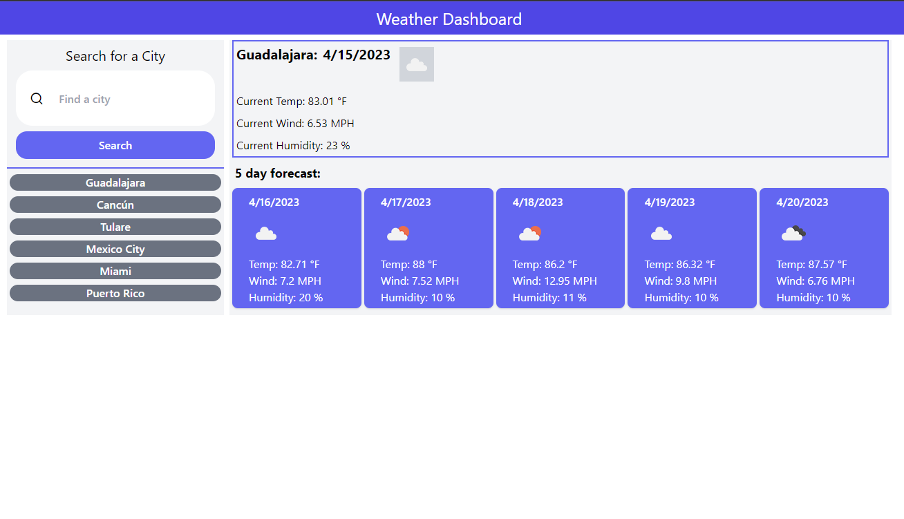

# Fer-117's Weather Dashboard

## Table of contents

- [Fer-117's Weather Dashboard](#fer-117s-weather-dashboard)
  - [Table of contents](#table-of-contents)
    - [Description](#description)
    - [Technologies](#technologies)
    - [Website](#website)
    - [The following image demonstrates the application:](#the-following-image-demonstrates-the-application)

### Description

A weather dashboard that will run in the browser and feature dynamically updated HTML and CSS. Using the 5 Day Weather Forecast API, we use a fecth to pass the user input and get the coordinates of the target city. Then we filter the data of the api call to have an array of with the weather data for a total of 6 days, the current date plus 5 future dates. I use `localStorage` to store any persistent data and then display that data on the cards.

### Technologies

- HTML
- Tailwind
- JavaScript
- fecth API
- openweathermap API

### Website

https://fer-117.github.io/workDay-Scheduler/

### The following image demonstrates the application:

