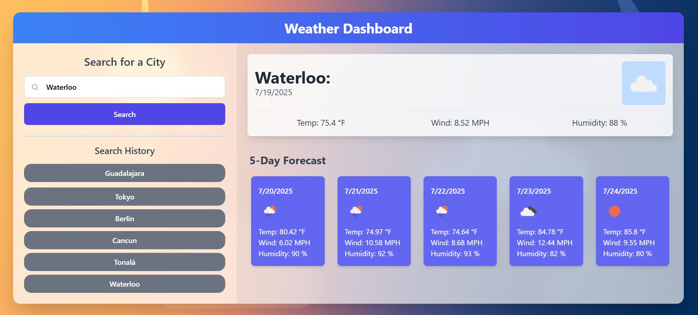

# Fer-117's Weather Dashboard (Full-Stack Edition)

This project is a modern, full-stack weather dashboard application that has been significantly refactored from its original version to incorporate a robust client-server architecture, a dynamic UI, and a comprehensive testing suite.

## Live Demo

**[View the deployed application here!](https://weather-dashboard-beta-eight-12.vercel.app/)**

## Project Evolution: Before & After

This project was initially a simple, client-side-only application. It has since been completely overhauled to use modern development practices, a secure backend, and a much-improved user interface.

|                 Before (Original Version)                  |                   After (Current Version)                    |
| :--------------------------------------------------------: | :----------------------------------------------------------: |
|                  _Original static layout_                  |               _New dynamic and responsive UI_                |
|  |  |

## Description

The backend is built with **Node.js** and **Express**, creating a secure API that handles all communication with the external OpenWeatherMap service. This protects sensitive API keys and separates concerns effectively. The frontend is a dynamic, single-page application built with vanilla **JavaScript** and styled with **Tailwind CSS**, featuring on-load geolocation to provide immediate weather data to the user.

## Key Features

- **Client-Server Architecture**: Securely handles API requests on the backend, protecting the API key.
- **Dynamic UI**: All weather forecast cards are generated dynamically in the DOM.
- **Geolocation on Load**: Asks for user permission to show local weather data immediately.
- **Search History**: Uses `localStorage` to save and display previous city searches for quick access.
- **Comprehensive E2E Testing**: A full test suite built with Selenium and Jest verifies all critical user journeys.

## Technologies Used

- **Frontend**: HTML5, Tailwind CSS (via CDN), JavaScript (ES Modules)
- **Backend**: Node.js, Express.js, CORS, Dotenv
- **API**: OpenWeatherMap 5 Day / 3 Hour Forecast API
- **Testing**: Selenium WebDriver, Jest, Babel, Chromedriver
- **Deployment**: Vercel

## Getting Started

To run this project locally, you will need to have Node.js installed.

### Setup

1.  Clone the repository.
2.  Navigate to the root directory of the project.
3.  Install all dependencies:
    ```bash
    npm install
    ```
4.  Create a `.env` file in the **root directory** and add your API key:
    ```
    API_KEY="YOUR_OPENWEATHERMAP_API_KEY"
    PORT=3001
    ```
5.  Start the local development server (which will auto-restart on changes):

    ```bash
    npm run server
    ```

    The server will be running on `http://localhost:3001`.

6.  Open the `client/index.html` file in your browser using an extension like VS Code's "Live Server".

## Testing

This project uses **Selenium WebDriver** for End-to-End (E2E) testing and **Jest** as the test runner. The testing strategy is documented in the `/tests/TestPlan.md` file.

To run the full test suite, navigate to the project's root directory and run:

```bash
npm test

Or, to run only the E2E tests:

npm run test:e2e
```
